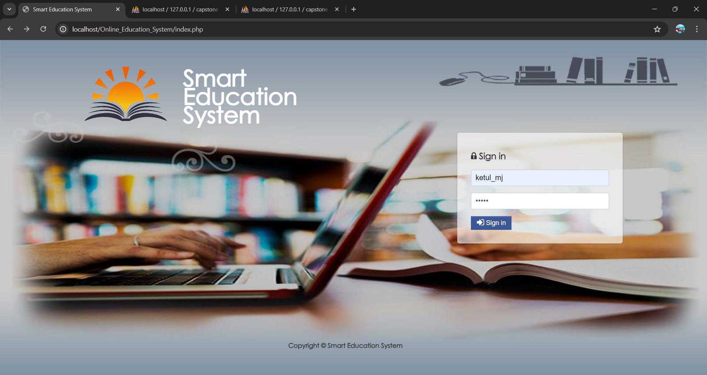
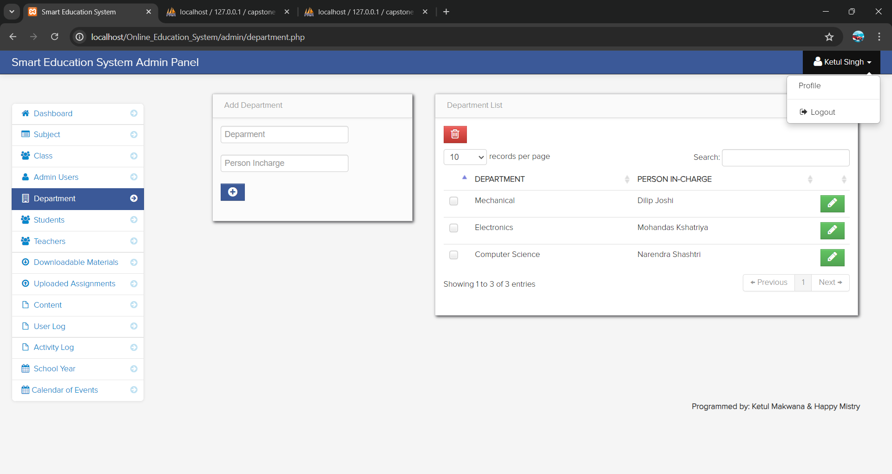
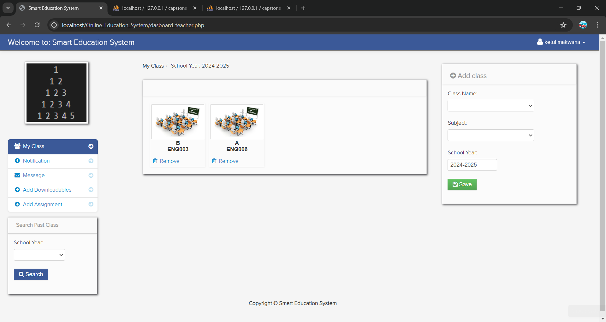
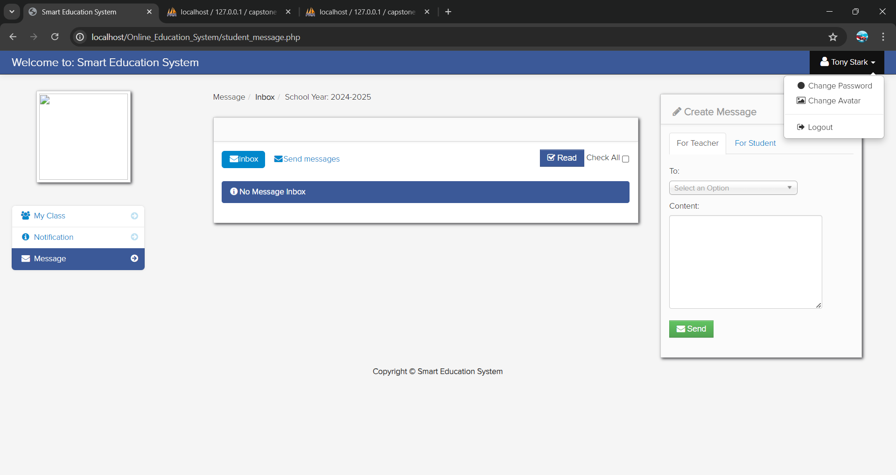

<h1>Online Learning Management System using PHP/MySQLi with Source Code</h1>

<h2>For the admin side of the system:</h2>
-Add, edit, delete student information       
-Add, edit, delete teacher information      
-Add an entry like the subject, class, school calendar 
-View log-in trail of every user 
-View logs of every user activity

<h2>For the Teacher User of the System:</h2>
-The teacher can create his/her Class       
-After creating a class the teacher  View the students for that particular class      
-Upload Downloadable materials for his/her class 
-Grade students assignment  
-Create a class calendar of events 
-Message co-teacher or students

<h2>For the Student user of the system :</h2>
-Sign up for his / her account       
-Download  downloadable materials in a class  
-Upload downloadable materialt  
-Message a teacher or his/ her classmate 

<h2>How to Run:</h2>

Download the source code and extract the zip file. 
Download or set up any local web server that runs PHP script. 
Open the web-server database and create a new database name it "capstone". 
Import the SQL file located in the database folder of the source code. 
Copy and paste the source code to the location where your local web server accessing your local projects. Example for XAMPP('C:\xampp\htdocs') 
Open a web browser and browse the project. E.g [http://localhost/Online_Education_System] and for  admin [http://localhost/Online_Education_System/admin]

<h2>Admin Access:</h2>
Email: Ketul Singh  
Password: ks_2002